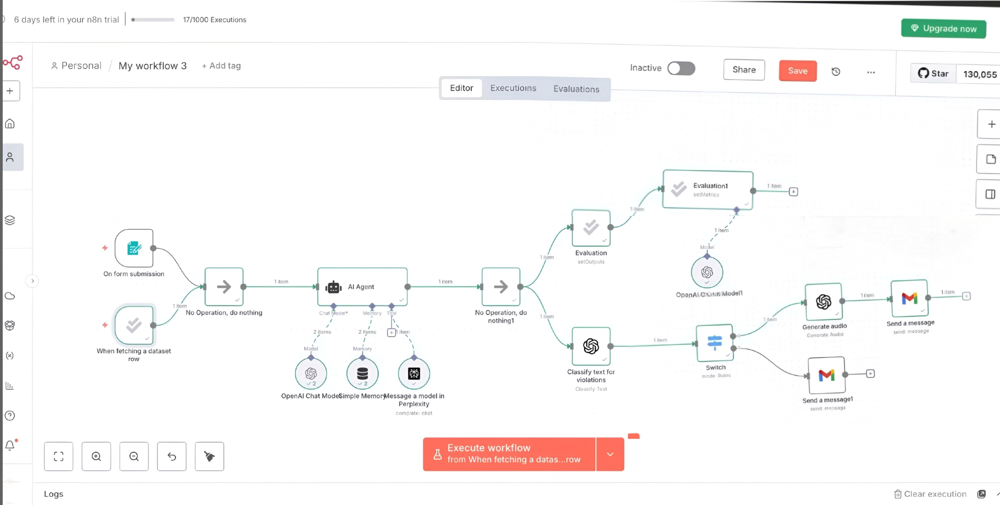

# 🎓 Project Echo: Agentic AI Pipeline for Verified, Multi-Modal Research Synthesis  

**Project Echo** is a high-assurance **AI Agent Workflow** that automates the retrieval, validation, and multi-modal delivery of research content.  
It combines **Perplexity AI API** for evidence-based article reading and summarization, **OpenAI GPT API** for guardrails and quality evaluation, and a **OpenAI TTS engine** for audio generation.  
The workflow ends with automated email delivery of summarised audio file, creating a complete end-to-end research automation pipeline.  

---

## 🎯 I. Workflow Overview  

Project Echo follows a structured, four-step pipeline:

1. **Article Retrieval & Summarization** → Fetches articles and generates initial summaries.  
2. **Guardrails & Verification** → Evaluates summaries to ensure factual accuracy and appropriateness.  
3. **Audio Generation** → Converts verified summaries into natural-sounding audio.  
4. **Automated Delivery** → Sends the final text + audio to the user via email.  

---

## 🛠️ II. Phase-by-Phase Breakdown  

### **Phase 1: Article Retrieval & Initial Summarization**  

| Component | Role | Tool / AI Used |
| :--- | :--- | :--- |
| **AI Agent (Orchestrator)** | Manages workflow steps and coordinates AI tools. | **n8n workflow** |
| **Article Fetch & Summarizer** | Reads articles, extracts key points, and generates initial summaries. | **Perplexity** |

---

### **Phase 2: Guardrails & Verification**  

| Component | Role | Tool / AI Used |
| :--- | :--- | :--- |
| **Summary Evaluation & Refinement** | Checks summaries for factual accuracy, clarity, and appropriateness; corrects errors. | **OpenAI GPT (guardrails / evaluation)** |

---

### **Phase 3: Audio Generation**  

| Component | Role | Tool / AI Used |
| :--- | :--- | :--- |
| **Text-to-Speech Generator** | Converts the verified summaries into natural-sounding audio files. | **TTS/Open AI** |

---

### **Phase 4: Automated Delivery**  

| Component | Role | Tool / AI Used |
| :--- | :--- | :--- |
| **Email Sender** | Delivers both text and audio files to the user. | **n8n Mailer Node + Email API** |

---

## 🖼️ III. Project Artifacts  

### 1. **Workflow Architecture**  
*Diagram showing the end-to-end pipeline from article retrieval to email delivery.*  

### 2. **Email Delivery Proof**  
*Screenshot of final email showing the text summary and attached audio.*  

---

## 📈 IV. Key Outcomes  

**Project Echo** demonstrates a fully functional, retrieval-grounded AI agent pipeline that:  
- **Fetches & summarizes research accurately** using **Perplexity API**.  
- **Ensures summary correctness and reliability** with **OpenAI API guardrails**.  
- **Provides multi-modal accessibility** via a **TTS engine**.  
- **Delivers content efficiently** through automated email integration.  

This pipeline guarantees **factual, auditable, and human-centric knowledge delivery**, making research consumption faster, more reliable, and accessible.
